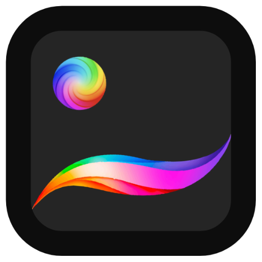

<p align="center">
  
</p>

<h1 align="center">Procreate Gallery</h1>

<p align="center">
  A self-hosted web gallery for browsing, organizing, and discovering your Procreate artwork.
  <br>
  Features automatic thumbnail extraction, AI-powered similarity detection, and a flexible tagging system.
</p>

<p align="center">
  
  
  
</p>

---

## Features

- **Automatic Ingestion** — Watches a directory for `.procreate` files and automatically extracts thumbnails
- **Similarity Detection** — Uses OpenAI's CLIP model to find visually similar artwork
- **Automatic Color Tagging** — Analyzes artwork and automatically tags with dominant colors
- **Tagging System** — Organize your artwork with custom tags and colors
- **Tag Management** — View, rename, and recolor tags; see all artwork using a specific tag
- **Duplicate Detection** — Identifies duplicate files by content hash
- **File Filtering** — Search by filename, filter by tags, or show only duplicates
- **Keyboard Navigation** — Navigate between artworks with arrow keys, press `T` to quickly add tags

---

## Quick Start with Docker

### Prerequisites

- Docker and Docker Compose installed
- A directory containing your `.procreate` files

### Setup

1. **Clone the repository**

   ```bash
   git clone <repository-url>
   cd procreate
   ```

2. **Create required directories**

   ```bash
   mkdir -p media/procreate media/thumbnails db
   ```

3. **Add your Procreate files**

   Copy or symlink your `.procreate` files into `media/procreate/`:

   ```bash
   # Copy files
   cp /path/to/your/artwork/*.procreate media/procreate/

   # Or create a symlink to your existing folder
   rm -rf media/procreate
   ln -s /path/to/your/procreate/files media/procreate
   ```

4. **Start the services**

   ```bash
   docker-compose up -d
   ```

5. **Access the gallery**

   Open [http://localhost:3000](http://localhost:3000) in your browser.

### Docker Services

| Service  | Description                                   |
| -------- | --------------------------------------------- |
| `web`    | Next.js web application (port 3000)           |
| `ingest` | Python file watcher that processes new files  |

### Viewing Logs

```bash
# All services
docker-compose logs -f

# Just the ingestion service
docker-compose logs -f ingest

# Just the web service
docker-compose logs -f web
```

---

## Quick Start without Docker

### Prerequisites

- Node.js 20+ or Bun
- Python 3.11+
- SQLite 3

### Setup

1. **Install Node.js dependencies**

   ```bash
   bun install
   # or
   npm install
   ```

2. **Install Python dependencies**

   ```bash
   pip install -r scripts/requirements.txt
   ```

3. **Create environment file**

   ```bash
   cp env.example .env
   ```

   Edit `.env` to configure paths:

   ```env
   PROCREATE_DATABASE_PATH=./db/procreate.db
   PROCREATE_SOURCE_PATH=./media/procreate
   PROCREATE_THUMBNAIL_PATH=./media/thumbnails
   ```

4. **Create directories**

   ```bash
   mkdir -p media/procreate media/thumbnails db
   ```

5. **Run both services concurrently**

   ```bash
   bun run run
   # or
   npm run run
   ```

   This starts both the Next.js dev server and the Python ingestion script.

### Running Services Separately

```bash
# Terminal 1: Start the ingestion script
python scripts/ingest.py

# Terminal 2: Start the web server
bun run dev
```

---

## Usage

### Gallery View

The main gallery displays all your Procreate files as thumbnails. You can:

- **Search** — Filter files by filename using the search box
- **Filter by tags** — Select one or more tags to filter (uses AND logic)
- **Show duplicates** — Toggle to only show files that have duplicates

### Detail View

Click any thumbnail to open the detail view, which shows:

- Full-size preview
- File metadata (name, path, dimensions, time spent, layers, DPI, file size, color profile, Procreate version)
- Tags with the ability to add/remove
- Similar artwork based on CLIP embeddings

### Tag Detail View

Click any tag badge to view the tag detail page, where you can:

- Rename the tag
- Change the tag color
- See all artworks using that tag

### Keyboard Shortcuts

| Key         | Action                                     |
| ----------- | ------------------------------------------ |
| `←` / `→`   | Navigate to previous/next artwork          |
| `T`         | Focus the tag input field                  |
| `Enter`     | Add the typed tag                          |
| `Backspace` | Remove the last tag (when input is empty)  |
| `↑` / `↓`   | Navigate tag suggestions                   |

---

## Tagging System

Tags are linked to files by their content hash (`file_hash`), not by file ID. This means:

- **Duplicates share tags** — All copies of the same file automatically have the same tags
- **Tags survive deletion** — If you delete a file and later restore it, the tags are automatically reapplied

### Adding Tags

1. Open a file's detail view
2. Press `T` or click the tag input field
3. Type a tag name and press `Enter`
4. Existing tags appear as suggestions as you type

### Removing Tags

Click the `×` button on any tag, or press `Backspace` when the input is empty to remove the last tag.

### Managing Tags

Visit `/tags` to see all tags with their colors, or click any tag badge anywhere in the app to view and edit that specific tag.

### Automatic Color Tagging

When artwork is ingested, the system automatically analyzes the thumbnail and tags it with the dominant color(s). The following color tags are available:

- red, orange, yellow, green, blue, purple, pink, black, white, brown, gray

This feature can be configured via environment variables:

| Variable                  | Default | Description                                              |
| ------------------------- | ------- | -------------------------------------------------------- |
| `AUTO_COLOR_TAG`          | `true`  | Enable/disable automatic color tagging                   |
| `AUTO_COLOR_TAG_LIMIT`    | `1`     | Number of dominant colors to tag (1–5)                   |
| `AUTO_COLOR_TAG_THRESHOLD`| `0`     | Minimum percentage of pixels required to qualify (0–100) |

**Examples:**

```bash
# Tag with up to 3 colors, each must represent at least 10% of the image
AUTO_COLOR_TAG_LIMIT=3
AUTO_COLOR_TAG_THRESHOLD=10

# Tag only the single most dominant color, no minimum threshold
AUTO_COLOR_TAG_LIMIT=1
AUTO_COLOR_TAG_THRESHOLD=0

# Disable automatic color tagging entirely
AUTO_COLOR_TAG=false
```

---

## Maintenance

### Purging Orphaned Tags

When you remove tags from all files, the tag definitions remain in the database. To clean up unused tags:

**Via CLI (in Docker):**

```bash
docker-compose exec ingest python scripts/ingest.py purge-tags
```

**Via CLI (local):**

```bash
python scripts/ingest.py purge-tags
```

**Via API:**

```bash
# Check how many orphaned tags exist
curl http://localhost:3000/api/tags/purge

# Delete orphaned tags
curl -X POST http://localhost:3000/api/tags/purge
```

### File Deletion Behavior

When a `.procreate` file is deleted from the watched directory:

- ✅ The file entry is removed from the database
- ✅ Similarity relationships are removed
- ✅ The thumbnail file is deleted
- ✅ **Tags are preserved** — linked by hash, so they persist for future restoration

> **Note:** Files are only removed when the ingestion service observes a deletion event. If the volume fails to mount or the service isn't running, no data is lost.

### CLI Commands

```bash
python scripts/ingest.py [command]

Commands:
  (none)       Start file watcher and process queue (default)
  purge-tags   Remove orphaned tags not linked to any file
  help         Show help message
```

---

## API Reference

### Files

| Endpoint                       | Method | Description                          |
| ------------------------------ | ------ | ------------------------------------ |
| `/api/procreate`               | GET    | List all files with tags             |
| `/api/procreate/[id]/similar`  | GET    | Get file details and similar images  |
| `/api/procreate/[id]/thumbnail`| GET    | Get thumbnail image                  |
| `/api/procreate/[id]/download` | GET    | Download original `.procreate` file  |

### Tags

| Endpoint                  | Method | Description                              |
| ------------------------- | ------ | ---------------------------------------- |
| `/api/tags`               | GET    | List all tags                            |
| `/api/tags/[id]`          | GET    | Get tag details and associated artworks  |
| `/api/tags/[id]`          | PATCH  | Update tag name and/or color             |
| `/api/procreate/[id]/tags`| GET    | Get tags for a file                      |
| `/api/procreate/[id]/tags`| POST   | Add a tag to a file                      |
| `/api/procreate/[id]/tags`| DELETE | Remove a tag from a file                 |
| `/api/tags/purge`         | GET    | Count orphaned tags                      |
| `/api/tags/purge`         | POST   | Delete orphaned tags                     |

---

## Configuration

### Docker Users

The environment variables can be left at their defaults. Instead, modify the **volume mappings** (host path side) in `docker-compose.yml` to point to where your files live on the host machine:

```yaml
volumes:
  - /path/to/your/procreate/files:/app/media/procreate:ro
  - /path/to/store/thumbnails:/app/media/thumbnails
  - /path/to/store/database:/app/db
```

#### Mapping Multiple Directories

If your `.procreate` files are spread across multiple directories, you can map each host directory to a subdirectory inside the container:

```yaml
volumes:
  # Map multiple host directories to subdirectories
  - /Users/me/Art/Portraits:/app/media/procreate/portraits:ro
  - /Users/me/Art/Landscapes:/app/media/procreate/landscapes:ro
  - /Volumes/ExternalDrive/Procreate:/app/media/procreate/external:ro
  # Thumbnails and database
  - ./thumbnails:/app/media/thumbnails
  - ./db:/app/db
```

The `PROCREATE_SOURCE_PATH` environment variable should remain `/app/media/procreate` — the ingest service will recursively scan all subdirectories.

### Non-Docker Users

These environment variables **must** be configured, as the defaults point to container paths that won't exist on your system:

| Variable                   | Default                 | Description                                            |
| -------------------------- | ----------------------- | ------------------------------------------------------ |
| `PROCREATE_DATABASE_PATH`  | `/app/db/procreate.db`  | Path to SQLite database (up to you where)              |
| `PROCREATE_SOURCE_PATH`    | `/app/media/procreate`  | Directory containing `.procreate` files                |
| `PROCREATE_THUMBNAIL_PATH` | `/app/media/thumbnails` | Directory for extracted thumbnails (up to you where)   |
| `AUTO_COLOR_TAG`           | `true`                  | Enable automatic color tagging on ingestion            |
| `AUTO_COLOR_TAG_LIMIT`     | `1`                     | Number of dominant colors to tag per artwork (1–5)     |
| `AUTO_COLOR_TAG_THRESHOLD` | `0`                     | Minimum % of pixels required for a color to qualify    |

Example configuration:

```bash
PROCREATE_DATABASE_PATH="$HOME/.local/share/procreate-gallery/procreate.db"
PROCREATE_SOURCE_PATH="$HOME/Documents/ProcreateBackup"
PROCREATE_THUMBNAIL_PATH="$HOME/.local/share/procreate-gallery/thumbnails"
```

---

## Architecture

```
┌─────────────────┐     ┌─────────────────┐
│   Web Browser   │────▶│   Next.js App   │
└─────────────────┘     └────────┬────────┘
                                 │
                                 ▼
                        ┌─────────────────┐
                        │     SQLite      │
                        │    Database     │
                        └────────┬────────┘
                                 │
                                 ▼
┌─────────────────┐     ┌─────────────────┐
│  .procreate     │────▶│ Python Ingest   │
│     Files       │     │    Service      │
└─────────────────┘     └─────────────────┘
                                 │
                                 ▼
                        ┌─────────────────┐
                        │  CLIP Embeddings │
                        │  (Similarity)    │
                        └─────────────────┘
```

---

## License

MIT

---

## Contributing

Contributions are welcome!

- **Ideas** — Create an Issue
- **Bug Reports** — Create an Issue
- **Bug Fixes / Improvements** — Create a Pull Request

---

<p align="center">
  Made by <strong>Bradie Tilley</strong>
</p>
